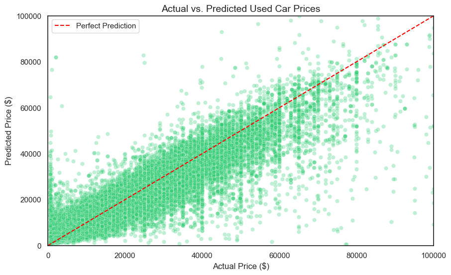

# ML-Regression-Used-Cars
A regression project to predict used car prices using real-world Craigslist data

Craigslist Car Price Predictor (Regression)
A project dedicated to predicting used car prices using 2021 Craigslist data. The goal was to move past simple linear relationships and build a model that handles the chaotic, non-linear nature of the used car market.

The Goal: Accuracy in a Messy Market
I wanted to see if I could predict the value of a car within a reasonable margin of error, despite the "noise" of online listings. My focus was on structural integrity—building a model that doesn't just work on this specific dataset, but follows logic that makes sense in the real world.

The Results (Test Set)
R² Score: 0.844 — The model explains about 84% of the variance in car prices.

MAE (Mean Absolute Error): ~$2,900 — On average, the model's price prediction is within 3k of the actual listing price (pretty good for a dataset where people list cars for $1 or $999,999).

Why it works
Future-Proof Age: Even though the data is from 2021, I didn't hardcode years. I used year_posted - vehicle_year. This means the depreciation logic is timeless—it calculates "how old was the car when listed," not just "what year is it now."

Target Encoding: For the model column (which has thousands of unique names), I used Target Encoding to turn car names into their historical price averages. This was the "miracle" step that boosted the R² significantly.

How I Built It
Algorithm: HistGradientBoostingRegressor. I chose this over Random Forest because it uses histogram-based binning, making it significantly faster on large datasets while handling missing values and categories natively.

The Math: I didn't just use raw numbers. I implemented Polynomial Features (squaring age/odometer) and Interaction Terms because  a 10-year-old car with 200k miles drops in value much faster than just "age" or "miles" alone would suggest.

Log Transformation: Prices aren't linear (the jump from $5k to $10k is more common than $95k to $100k). I trained the model on log(price) to normalize the target and reduce the impact of extreme outliers.

How to Run
Clone the repo.

Install requirements: pip install -r requirements.txt

Open the Notebook: main.ipynb.

Predict: You can feed any vehicle's specs into the final hgb_final model to get an instant valuation.

What's Next
Pipeline Automation: I want to wrap the entire feature engineering logic (the age calculation, the mapping, etc.) into a single Sklearn Pipeline object so it can handle 100% raw data without manual prep.

Possible Deployment: Converting this into a small web app where you can put in your car's mileage and year to see if you're getting a good deal.

Below is a depiction of how the model tracks real-world pricing. The red dashed line represents a "perfect" prediction. The tight cluster of green dots shows the model is highly reliable, especially in the heart of the market ($5k - $30k range).

